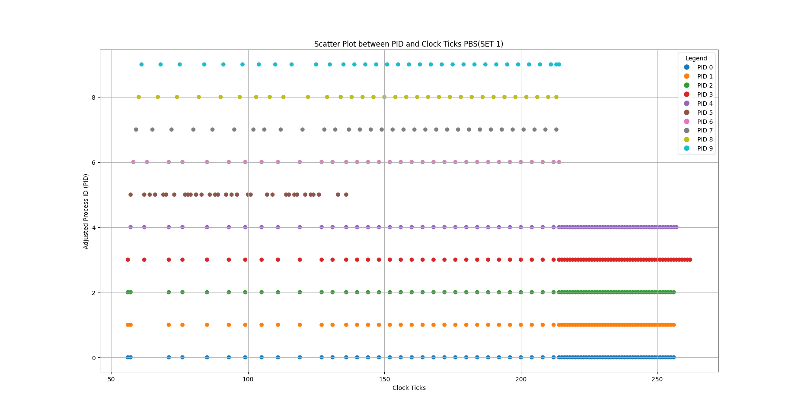
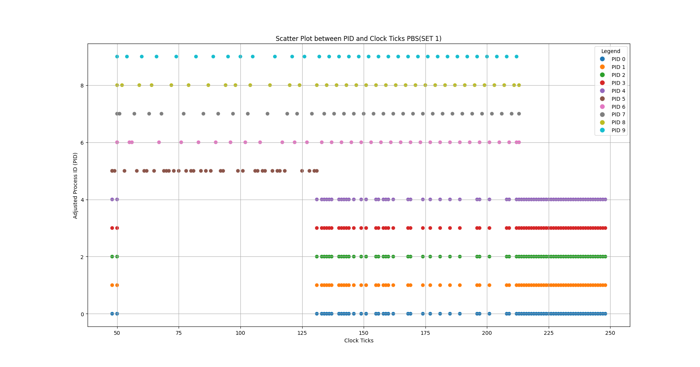
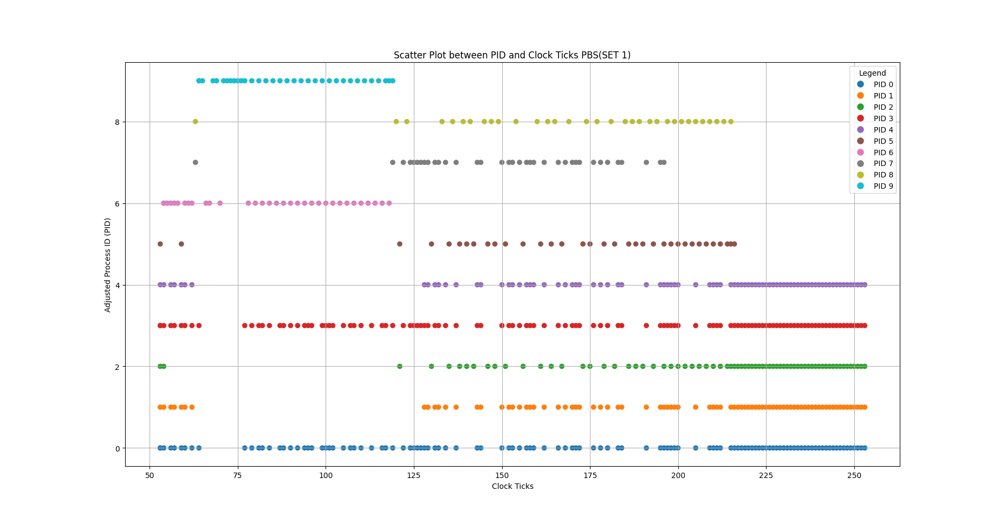
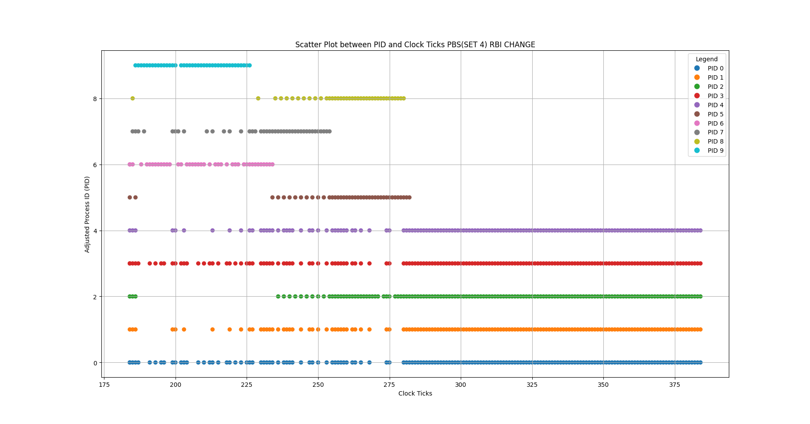
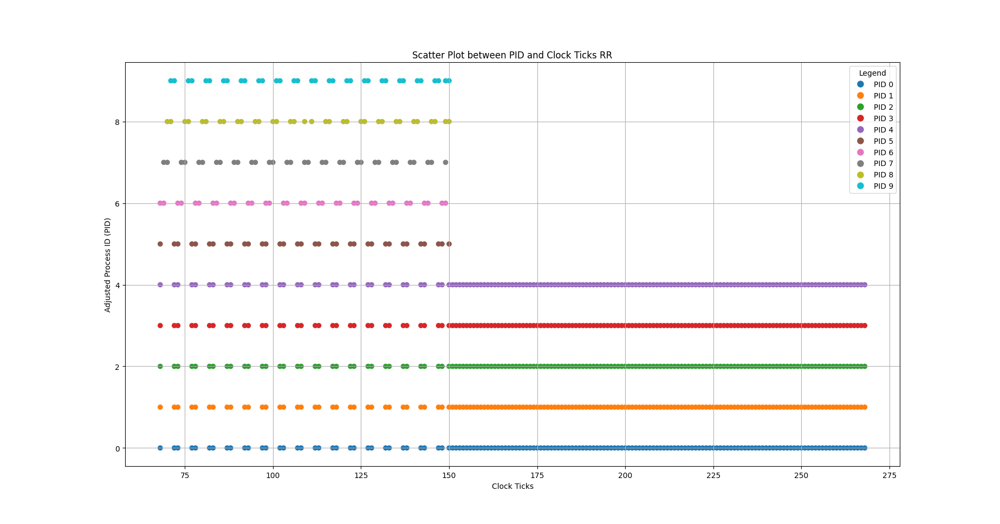
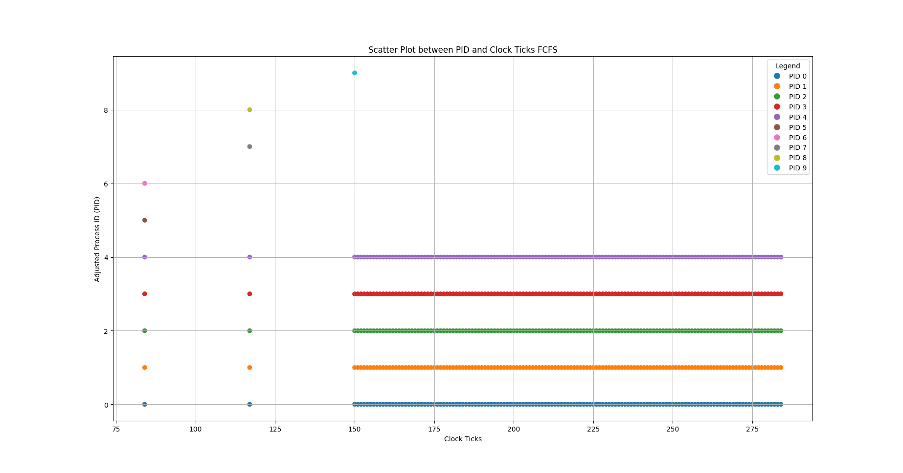

this is the report containg the detailed explanations
# XV-6 PBS CAFE SIM PARLOUR SIM `ASSUMPTIONS`
```
1)Number of times is more then it has low priority.
2)Assumptions if customer leaves before barista is free then order is not considered and even coffee is not prepared.
3)lowest index is served always.
4)Every Value for preparation , tolerance is non zero
5)parlour is closed only if all machines are done with the process there is no machine to work
6)checks machine availability then toppings availability when machine is trying to take customer order.
```

# XV-6 PBS

## IMPLEMENTATION

The priority based scheduler schedules the process with the highest priority , the priority of the process is determined by the paratemers like static priority , dynamic priority and recent bahaviour index. 
#### Approach
- At first we define a system call set_prioirty to set the priority of the each process during its fork in schedulertest.The call takes two arguments: `pid` (process ID) and `priority`.The system call returns the old Static Priority of the process and sets the given new peiority to static priority.
- Then we assign the process a default value of 50 satic prioirty and 25 RBI at the begining using set_priority function written in proc.c.To identity the changes we define static priority,dynamic priority,rbi in the process structure.We reschedule the process by "yield" if priority increases.
- In the scheduler,to schedule the process with highest priority we search the all processes find the highest priority and assign the process to the CPU.
- In trap.c as it is preemptive we yield in the usertrap and kerneltrap after every 1 sec. 
```c
    RBI = max(Int((3 * RTime - STime - WTime) / (RTime + WTime + STime + 1) * 50), 0)
```
The dynamic priority is calculated as following:
```c
    DP=min(SP+RBI,100)
```
set_priority.c
```
int main(int argc , char *args[])
{
    if(argc<3){
        printf("Please give complete data\n");
        exit(1);
        return -1;
    }
    int pid=atoi(args[1]);
    int priority=atoi(args[2]);
    if(priority<=100 && priority>=0)
    {
        int old_sp = set_priority(pid, priority);
        if (old_sp == -1) {
            printf("Process with given pid does not exists.\n");
            exit(1);
            return -1;
        }
    }
    else
    {
        printf("Please give priority between 1 and 100\n");
        exit(1);
        return -1;
    }
    exit(0);
}
```
in proc.c
```
int set_priority(int pid , int priority){
  int found=-1;
  for(struct proc *p=proc;p<&proc[NPROC];p++){
    acquire(&p->lock);
    if(p->pid==pid){
      found=p->stat_priority;
      p->stat_priority=priority;
      if(p->rtime+p->stime==0){
        p->rbi=15;
        p->rtime=0;
        p->stime=0;
      }
      else{
        int x=(int)(((3*p->rtime-p->stime-p->watime)/(p->rtime+p->stime+p->watime+1))*50);
        if(x>0){
          p->rbi=x;
        }
        else{
          p->rbi=0;
        }
        p->rtime=0;
        p->stime=0;
      }
      int old_dp=p->dyna_priority;
      p->dyna_priority=(p->stat_priority+p->rbi>100?100:p->stat_priority+p->rbi);
      //printf("process %d is about to run with priority %d %d\n",pid,p->dyna_priority,old_dp);
      if(old_dp>p->dyna_priority){
        release(&p->lock);
        yield();
      }
      else{
      //printf("process %d is about to run with priority %d\n",pid,p->dyna_priority);
      release(&p->lock);
      break;
      }
    }
    else{
    release(&p->lock);
    }
  }
  return found;
}
```
in scheduler function
```
#ifdef PBS
  int maxi_priority = 0;
  struct proc *p = 0;
  int x = 0;
  struct proc *run_proc = 0;
  for (p = proc; p < &proc[NPROC]; p++) {
    acquire(&p->lock);
    if (p->state == RUNNABLE) {
      if (p->rtime + p->stime > 0) {
        x = (int)(((3 * p->rtime - p->stime - p->watime) / (p->rtime + p->stime + p->watime + 1)) * 50);
      }
      if (x > 0) {
        p->rbi = x;
      } else {
        p->rbi = 0;
      }
      p->dyna_priority = (p->stat_priority + p->rbi > 100 ? 100 : p->stat_priority + p->rbi);

      if (run_proc == 0 || maxi_priority > p->dyna_priority ||
          (maxi_priority == p->dyna_priority && run_proc->sched_times > p->sched_times) ||
          (maxi_priority == p->dyna_priority && run_proc->sched_times == p->sched_times && run_proc->clktik > p->clktik)) {
        // Update the maximum priority process
        maxi_priority = p->dyna_priority;
        if (run_proc) {
          release(&run_proc->lock);
        }
        run_proc = p;
      } else {
        // Release the lock for the current process if it's not selected
        release(&p->lock);
      }
    } else {
      // Release the lock for non-RUNNABLE processes
      release(&p->lock);
    }
  }

  if (run_proc != 0) {
    if (run_proc->state == RUNNABLE) {
      //printf("process %d is running with priority at %d\n", run_proc->pid, ticks);
      run_proc->sched_times += 1;
      run_proc->state = RUNNING;
      c->proc = run_proc;
      swtch(&c->context, &run_proc->context);
      // Process is done running for now.
      // It should have changed its p->state before coming back.
      c->proc = 0;
      release(&run_proc->lock);
    }
  }
#endif
  }
}
```
in syproc.c
```
uint64
sys_set_priority(void)
{
  int priority, pid;
  argint(0, &pid);
  argint(1, &priority);
  return set_priority(pid, priority);
}
```
in syscall.c ,usys.pl ,user.h , syscall.h added the system call modified it.
in trap.c preempted it by adding yield
#### How to run
- Run `make clean` to clean the files created by make.
- Run `make qemu SCHEDULER=PBS` to run the xv6 in qemu emulator.
- Run `schedulertest` to test the PBS and `set_priority` to set a priority to a process

## Analysis

set 1 

ALL PROCESS WITH SAME PRIORITY
```bash
Process 5 with 9 finished
Process 6 with 10 finished
Process 7 with 11 finished
Process 9 with 13 finished
Process 8 with 12 finished
Process 0 with 4 finished
Process 1 with 5 finished
Process 2 with 6 finished
Process 3 with 7 finished
Process 4 with 8 finished
Average rtime 15,  wtime 153
Name	s_time
init 	 255
sh 	 255
schedulertest 	 200
```


set 2

IO PROCESS LOW PRIORITY AND CPU-BOUND HIGH PRIORITY
```bash
Process 5 with 9 finished
Process 6 with 10 finished
Process 7 with 11 finished
Process 8 with 12 finished
Process 9 with 13 finished
Process 0 with 4 finished
Process 1 with 5 finished
Process 2 with 6 finished
Process 3 with 7 finished
Process 4 with 8 finished
Average rtime 15,  wtime 152
Name	s_time
init 	 260
sh 	 260
schedulertest 	 200
```


set 3

RANDOMLY ASSIGNING BASED ON A FUNCTION
```bash
Process 6 with 10 finished
Process 9 with 13 finished
Process 7 with 11 finished
Process 5 with 9 finished
Process 8 with 12 finished
Process 0 with 4 finished
Process 3 with 7 finished
Process 1 with 5 finished
Process 4 with 8 finished
Process 2 with 6 finished
Average rtime 15,  wtime 139
Name	s_time
init 	 259
sh 	 259
schedulertest 	 198
```


set4

CHANGING THE DEFAULT RBI TO 15 TO OBSERVE ANY CHANGE 


RR AND FCFS




Due to the change in the static priority ,the dynamic priority got updated, as the default static priority is 50, as for the default values of runtime, waittime and sleep time as 0, the RBI value remains0, so the dynamic priority is equal to static priority         
But when the static priority is incresed (value got reduced), the dp also decreases and as for the schedulertest policy it selects the process with least dp.
The above is policy to set the process run

In the above we can see same process are schedule differntly because of different ways of assigning the priorities.When the default is choosen by giving all same priority it is similar the distribution is to round robin. But when we try to change the priorities keeping the CPU as higher prioirty than IO-BOUND we see the scheduler also follows it and assigns the higher priority.We see the plot is reversed.AND the last one we see that the group of process with high priority are assigned first then the other group with the second highest priority then the third group.The last plot shows the change in the allocation due to differnt RBI
By the above plots we can see that there is a lot of impact of static and dynamic prioirty in allocating the process while scheduling.

# CAFE SIMULATION
The task involves the implementation of the Cafe Simulation with a focus on ensuring efficient coffee preparation and customer satisfaction.This is implemented utilizing multi-threading concepts, semaphores, and mutex locks to achieve thread safety and avoid issues like deadlocks and busy waiting.

Certainly! Here's a more detailed explanation of each function in Markdown format:

## Structures:

#### 1. CoffeeType:

- **Members:**
  - `name`: A string representing the name of the coffee type.
  - `preparation_time`: An integer representing the time it takes to prepare this type of coffee.

#### 2. Customer:

- **Members:**
  - `id`: An integer representing the unique identifier of the customer.
  - `coffee`: A string representing the type of coffee the customer orders.
  - `arrival_time`: An integer representing the time when the customer arrives.
  - `tolerance`: An integer representing the time tolerance of the customer.
  - `barista_index`: An integer representing the index of the barista serving the customer.
  - `served`: A flag indicating whether the customer has been served.
  - `left`: A flag indicating whether the customer has left.
  - `coffee_preparation_start_time`: The time when the barista starts preparing the customer's coffee.
  - `wait_time`: The total time the customer has waited.
  - `coffe_prep`: The time it takes to prepare the customer's coffee.

#### 3. Barista:

- **Members:**
  - `id`: An integer representing the unique identifier of the barista.
  - `served_customers`: An integer representing the count of customers served by the barista.

## Variables:

#### Global Variables:

- `start_time`: The starting time of the simulation.
- `current_time`: The current time during the simulation.
- `simulation`: A flag indicating whether the simulation is running.
- `num_baristas`: The number of baristas in the simulation.
- `num_coffee_types`: The number of coffee types available.
- `num_customers`: The number of customers in the simulation.
- `coffee_wasted`: Counter for the number of coffees wasted.
- `max_customer`: The maximum time a customer can stay in the simulation.
- `coffee_types`: An array of `CoffeeType` structures.
- `customers`: An array of `Customer` structures.
- `global_time`: A global clock to track simulation time.
- `baristas`: An array of `Barista` structures.

## Mutexes and Semaphores:

- `mutex`: A mutex lock for controlling critical sections.
- `time_sem`: A semaphore controlling access to the global time.
- `customer_sem`: A semaphore controlling access to customer threads.

## Functions:

#### 1. `all_customers_served_and_left()`

- **Task:** Checks if all customers have been served or left.
- **Flow:**
  - Iterates through customers and checks if any are neither served nor left.
  - Returns 1 if all customers have left or been served, 0 otherwise.

#### 2. `find_max_customer()`

- **Task:** Finds the maximum time a customer can stay in the simulation.
- **Flow:**
  - Iterates through customers to find the maximum time.
  - Updates the `max_customer` variable with the calculated value.

#### 3. `timer_thread(void* arg)`

- **Task:** Updates the global time, checks for simulation termination conditions, and calculates customer wait times.
- **Flow:**
  - Continuously updates the global time based on the system time.
  - Checks for simulation termination conditions (all customers served or global time exceeds `max_customer`).
  - Calculates and updates customer wait times based on their arrival and the current global time.
  - Sleeps for 1 second in each iteration.

#### 4. `customer_arrival(void* arg)`

- **Task:** Simulates customer arrival, order placement, and departure.
- **Flow:**

-The `customer_arrival` function simulates the arrival and behavior of a customer in a coffee shop. The function is executed by each customer thread. Let's break down the key aspects of this function:
##### Arrival Time and Order Placement

- The function begins by waiting for the global time to catch up with the customer's arrival time. This is achieved by entering a while loop and checking whether the current simulation time is less than the customer's arrival time.

- Once the global time catches up, the customer proceeds to place an order. The function prints messages indicating the customer's arrival and the order they place.

- The function then signals the `customer_sem` semaphore, allowing the barista thread to be unblocked and proceed with serving the customer.

##### Departure Time and Tolerance

- The function calculates the time when the customer will leave, considering their arrival time, order preparation time, and tolerance.

- Another while loop is used to wait until the calculated leave time. If the global time surpasses this leave time and the customer hasn't been served or left due to tolerance, the function prints a message indicating that the customer leaves without receiving their order.

- The function then signals both the `time_sem` and `customer_sem` semaphores, allowing other threads to proceed.

#### 5. `barista_work(void* arg)`

- **Task:** Simulates barista work, serving customers, and updating served customer count.
- **Flow:**
The `barista_work` function simulates the work performed by each barista in the coffee shop. It is executed by each barista thread. Let's analyze the key components of this function:

##### Customer Order Processing

- The function starts by waiting for a customer to place an order. This is achieved by waiting on the `customer_sem` semaphore.

- Once a customer places an order, the barista enters a critical section protected by a mutex. This critical section involves searching for a customer whose order can be prepared by the current barista.

- The barista looks for a customer who has not been served, has not left, and has not been assigned to any other barista. Additionally, the customer's tolerance must allow for the preparation time of their ordered coffee type.

- If such a customer is found, the barista marks the customer as being served by updating their `barista_index`.

##### Coffee Preparation and Serving

- If a suitable customer is found, the barista prints messages indicating the start and completion of coffee preparation. The barista then updates the served customer count.

- The function ensures that the customer has not left before completing the coffee preparation. If the customer has left, the function increments the `coffee_wasted` counter to keep track of wasted coffee.

- The critical section is exited by unlocking the mutex.

- The function repeats these steps until all customers have been served and left or the simulation time reaches the specified maximum.

#### 6. `main()`

- **Task:** Reads input, initializes structures, and starts threads.
- **Flow:**
  - Reads input for the number of baristas, coffee types, and customers.
  - Initializes coffee types and customer structures.
  - Creates semaphores and mutex.
  - Creates timer, customer, and barista threads.
  - Joins customer and barista threads.
  - Calculates and prints average waiting time and wasted coffee.
  - Cleans up semaphores and mutex.
  - Exits the program.
### Summary

Both functions contribute to simulating the interaction between customers and baristas in a coffee shop. The `customer_arrival` function models customer arrivals, order placements, and departures based on tolerance. The `barista_work` function simulates the work of baristas in processing customer orders, preparing coffee, and tracking served customers. The use of semaphores and mutexes ensures proper synchronization and prevents race conditions between threads. Overall, these functions collectively create a multithreaded simulation of a coffee shop scenario.

## Questions

`Waiting Time:`
The average time a customer spends waiting for their coffee is calculated in the program as average waitm.
As for the given example the average wait time is 2.00.

If the Cafe had infinite baristas, the average wait time will be 1.00 as the customer waits for one second before the barista starts preparing even barista is available.

`Coffee wastage:`
The number of orders that were not fulfilled in time is calculated in the program as wasted_coffee_count.
In the case given, it is 1.1 coffee is wasted.Here wasted means the customer places the order but leaves before completion. 

# Ice Cream Parlour Simulation

## Structures:

### Machine Structure
```c
struct Machine {
    int id;
    int tm_start;
    int tm_stop;
};
```
- Represents a machine in the parlour.
- `id`: Unique identifier for the machine.
- `tm_start`: Start time of the machine's shift.
- `tm_stop`: Stop time of the machine's shift.

### Flavor Structure
```c
struct Flavor {
    char name[20];
    int prep_time;
};
```
- Represents an ice cream flavor.
- `name`: Name of the flavor.
- `prep_time`: Preparation time required for the flavor.

### Topping Structure
```c
struct Topping {
    char name[20];
    int quantity;
};
```
- Represents a topping that can be added to an ice cream.
- `name`: Name of the topping.
- `quantity`: Available quantity of the topping.

### CustomerOrder Structure
```c
struct CustomerOrder {
    int customer_id;
    int arrival_time;
    int num_ice_creams;
    struct IceCream {
        char flavor[20];
        char toppings[MAX_TOPPINGS][20];
        int num_toppings;
    } ice_creams[MAX_FLAVORS];
    sem_t order_sem;
    int machine_index[MAX_FLAVORS];
    int prepared_index[MAX_FLAVORS];
    int served;
    int served_machine;
    int checked;
};
```
- Represents a customer's order.
- `customer_id`: Unique identifier for the customer.
- `arrival_time`: Time when the customer arrives.
- `num_ice_creams`: Number of ice creams in the order.
- `ice_creams`: Array of structures representing each ice cream in the order.
- `order_sem`: Semaphore controlling access to the customer's order.
- `machine_index`: Array storing the machine index for each ice cream.
- `prepared_index`: Array indicating whether each ice cream is prepared.
- `served`: Flag indicating whether the customer has been served.
- `served_machine`: Flag indicating whether the customer has been served by a machine.
- `checked`: Flag indicating whether the order ingredients have been checked.

## Variables:

- `N, K, F, T`: Parameters defining the simulation (number of machines, capacity, flavors, toppings).
- `start_time`: Time when the simulation starts.
- `current_time`: Current time during the simulation.
- `global_time`: Global time variable shared among threads.
- `simulation`: Flag indicating whether the simulation is ongoing.
- `num_customers_served`: Counter for the number of customers served.
- `orders[MAX_CUSTOMERS]`: Array to store customer orders.
- `machines[MAX_MACHINES]`: Array to store machine information.
- `flavors[MAX_FLAVORS]`: Array to store flavor information.
- `toppings[MAX_TOPPINGS]`: Array to store topping information.
- `num_customers`: Counter for the number of customers.
- `prev_newline`: Flag indicating the presence of consecutive newline characters.
- Various semaphores to synchronize and control access to shared resources.

## Functions:
### `timer_thread`

This function simulates the passage of time. It monitors the maximum stop time of machines and triggers the end of the simulation when the maximum stop time is reached.

1. **Function Signature:**
   ```c
   void* timer_thread(void* arg);
   ```

2. **Parameters:**
   - `arg`: Not used in this function.

3. **Flow:**
   - The function enters an infinite loop to continuously check the global time.
   - It waits on the `time_sem` semaphore to acquire the time.
   - Checks if the global time has reached the maximum stop time of machines.
   - If so, it sets the `simulation` flag to 1, indicating the end of the simulation.
   - Releases the `time_sem` semaphore.

4. **Notes:**
   - This function is crucial for controlling the overall flow of the simulation and ensuring it stops when required.

### `customer_thread`

This function simulates the behavior of a customer. It waits for the right arrival time, checks ingredient availability, places orders, and leaves if necessary.

1. **Function Signature:**
   ```c
   void* customer_thread(void* arg);
   ```

2. **Parameters:**
   - `arg`: A pointer to the `CustomerOrder` structure representing the customer's order.

3. **Flow:**
   - The function enters an infinite loop to continuously check the global time.
   - Waits for the right arrival time by comparing the customer's arrival time with the global time.
   - Once the customer arrives, it enters a critical section protected by the `customer_sem` semaphore.
   - Checks if the parlour is at capacity (K customers). If not, it proceeds to check ingredient availability.
   - If ingredients are available, the customer places an order, prints order details, and signals the `served_sem`.
   - If ingredients are insufficient, the customer leaves with an unfulfilled order, updating relevant flags.
   - Releases the `customer_sem` semaphore.

4. **Notes:**
   - This function models the customer's arrival, order placement, and departure based on ingredient availability and capacity.

### `check_toppings_availability`

This function checks the availability of toppings, indicating whether at least one topping is available.

1. **Function Signature:**
   ```c
   int check_toppings_availability();
   ```

2. **Flow:**
   - Iterates through toppings and checks if the quantity of any topping is greater than 0.
   - Returns 1 if at least one topping is available, and 0 if all toppings are zero.

3. **Notes:**
   - This function is used to determine whether a customer's order can be fulfilled based on ingredient availability.

### `machine_thread`

This function simulates the behavior of a machine. It prepares ice creams for customers based on availability and order requirements.

1. **Function Signature:**
   ```c
   void* machine_thread(void* arg);
   ```

2. **Parameters:**
   - `arg`: A pointer to the `Machine` structure representing the machine.

3. **Flow:**
   - The function enters an infinite loop to continuously check the machine's status.
   - Waits for the right start time by comparing the machine's start time with the global time.
   - Once the machine starts, it enters a critical section protected by a mutex.
   - Searches for an order that can be prepared based on availability, order status, and preparation time.
   - If an order is found, it marks the order as being prepared by the current machine and simulates the preparation time.
   - If all ice creams for a customer are prepared, the customer is considered served, and the relevant flags are updated.
   - Releases the mutex.

4. **Notes:**
   - This function models the machine's operation, checking for available orders and preparing ice creams.

### `find_flavor_index`

This function finds the index of a flavor in the flavors array based on the flavor name.

1. **Function Signature:**
   ```c
   int find_flavor_index(const char* flavor_name);
   ```

2. **Parameters:**
   - `flavor_name`: The name of the flavor to find.

3. **Flow:**
   - Iterates through the flavors array and compares the flavor names.
   - Returns the index if the flavor is found, or -1 if the flavor is not found.

4. **Notes:**
   - This function is a utility function used to look up the preparation time of a specific flavor.

### `checkIngredients`

This function checks the availability of ingredients for a specific order and handles ingredient subtraction if available.

1. **Function Signature:**
   ```c
   int checkIngredients(int m, int n);
   ```

2. **Parameters:**
   - `m`: Index of the customer order.
   - `n`: Index of the ice cream in the order.

3. **Flow:**
   - Checks the availability of toppings for the specified ice cream.
   - If ingredients are available, subtracts the required quantity from the available quantity.
   - If ingredients are insufficient, prints a message and updates relevant flags.
   - Returns 1 if ingredients are available, and 0 if insufficient.

4. **Notes:**
   - This function is used in the customer thread to check and subtract toppings for an ice cream.

### `main`

This function is the entry point of the program, reading input parameters, machine, flavor, and topping information. It initializes semaphores and global variables, creates threads for customers, machines, and the timer, and waits for threads to finish.

1. **Function Signature:**
   ```c
   int main();
   ```

2. **Flow:**
   - Reads input parameters, machine, flavor, and topping information from standard input.
   - Initializes semaphores and global variables.
   - Creates threads for customers, machines, and the timer.
   - Waits for customer and machine threads to finish.
   - Prints closing messages and ends the program.

3. **Notes:**
   - This function orchestrates the overall flow of the program, including initialization, thread creation, and termination.
## QUESTIONS

### Minimizing Incomplete Orders:

To minimize incomplete orders and enhance the parlor's reputation, the simulation can be redesigned by implementing a more dynamic ingredient replenishment system and a more efficient order acceptance process.

#### Approach:

1. **Dynamic Ingredient Replenishment:**
   - Implement a continuous checking mechanism for ingredients before processing each order.
   - Introduce a separate thread or mechanism to replenish ingredients continuously during the simulation.
   - Utilize semaphores or locks like synchronization mechanisms to control access to shared ingredient data structures to avoid race conditions during replenishment.

2. **Pre-Check Ingredient Availability And Sorting Customers:**
   - Before accepting an order, check the availability of ingredients.
   - If ingredients are insufficient, instantly reject the order to avoid incomplete orders.
   - This pre-checking step can help in rejecting orders early, minimizing the impact on the parlor's reputation.
   - Sort the customers according to their tolerance and fulfill the customer order with low tolerance first.If his tolerance is low than preparation time , do not accept the order.

3. **Order Acceptance Threshold:**
   - Implement a mechanism to accept orders based on the availability of ingredients and the current workload.
   - Adjust the acceptance threshold dynamically to ensure that only feasible orders are accepted,reducing the chances of incomplete orders.

4. **Parallel Processing:**
   - Explore parallel processing using multithreading threading for order fulfillment to optimize the use of machines.

### Ingredient Replenishment:

Assuming ingredients can be replenished by contacting the nearest supplier, adjustments can be made to the parlour order acceptance/rejection process to facilitate efficient ingredient replenishment.

#### Adjustments:

1. **Dynamic Replenishment Thread:**
   - Introduce a separate replenishment thread or mechanism that periodically checks ingredient levels.
   - If any ingredient falls below a certain threshold, trigger a replenishment order to the supplier.
   - We may also think of observing the pattern of customer order at begining of program and calculate the necessity and trigger when the customer is going to get the machine.

2. **Asynchronous Replenishment:**
   - We should allow the replenishment process to happen asynchronously, so it doesn't block the main simulation.
   - Use semaphores or locks or conditional variables like synchronization mechanisms to ensure proper coordination between the replenishment process and the main simulation.

3. **Replenishment Time Consideration:**
   - Factor in the time it takes for ingredients to be replenished when considering order acceptance.
   - If an order can be fulfilled after replenishment within the customer's tolerance time, accept the order.

4. **Order Queues:**
   - Implement a queue system for orders that cannot be immediately fulfilled due to ingredient shortages.
   - Process these orders as soon as the replenishment is complete.

5. **Supplier Contact Simulation:**
   - Simulate the time it takes to contact the supplier and receive the replenishment.
   - Adjust the parlour's operation based on the expected time for ingredient replenishment.

### Unserviced Orders:

To avoid or minimize the number of unserviced orders or customers having to wait until the parlor closes, several strategies can be implemented.

#### Strategies:

1. **Optimized Resource Utilization:**
   - Implement a dynamic scheduling algorithm to optimize the use of machines.
   - Prioritize orders based on their complexity and preparation time, ensuring efficient use of machine resources.

2. **Queue Management:**
   - Introduce a sophisticated queue management system for customers.
   - Serve customers on a first-come, first-served basis, but consider the complexity of their orders.

3. **Customer Communication:**
   - Implement a mechanism to communicate estimated wait times to customers.
   - Transparently inform customers about potential delays due to machine availability or ingredient shortages.

4. **Dynamic Machine Allocation:**
   - Dynamically allocate machines based on the workload and order complexity.
   - Adjust the number of active machines to match the current demand and reduce customer waiting times.

5. **Preventive Ingredient Management:**
   - Predict potential ingredient shortages by analyzing the order queue.
   - Implement proactive ingredient management to prevent unserviced orders.

6. **Dynamic Tolerance Adjustment:**
   - Dynamically adjust customer tolerance based on current parlor conditions.
   - Customers with higher tolerance might wait longer, providing flexibility during peak hours.

7. **Real-time Order Adjustments:**
   - Allow customers to modify their orders in real-time to accommodate ingredient shortages or machine availability issues.

By implementing these strategies, the simulation can be enhanced to provide a more efficient and customer-friendly experience, minimizing the impact of unserviced orders and optimizing overall parlor operations.
